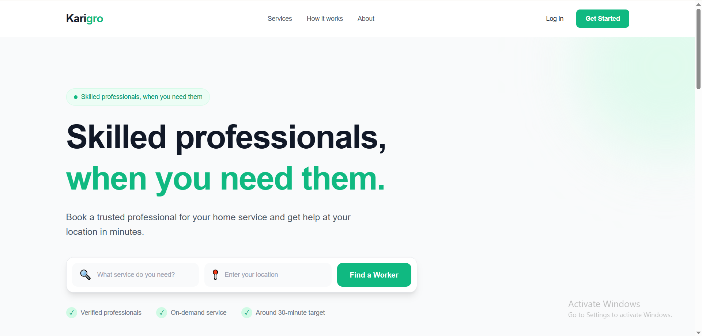
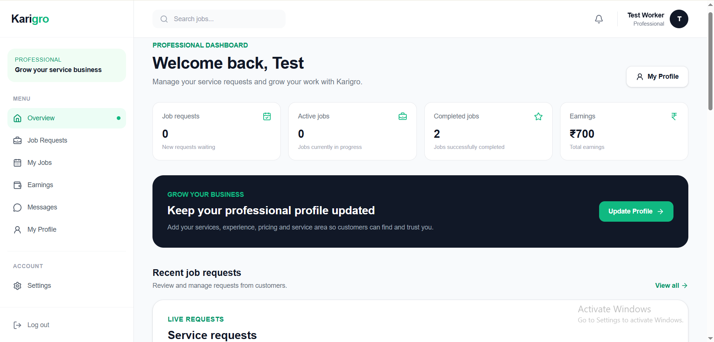
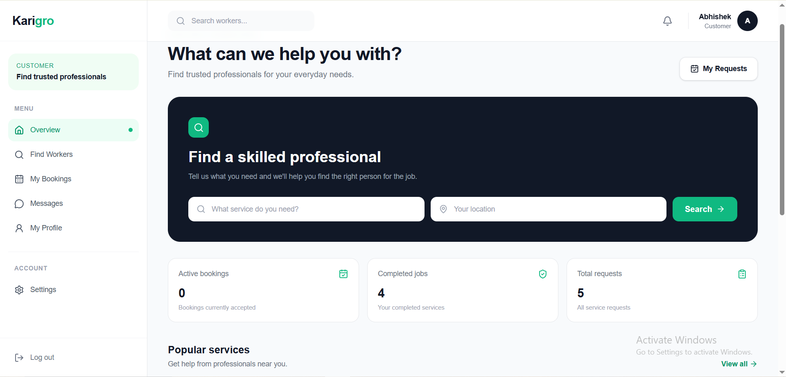
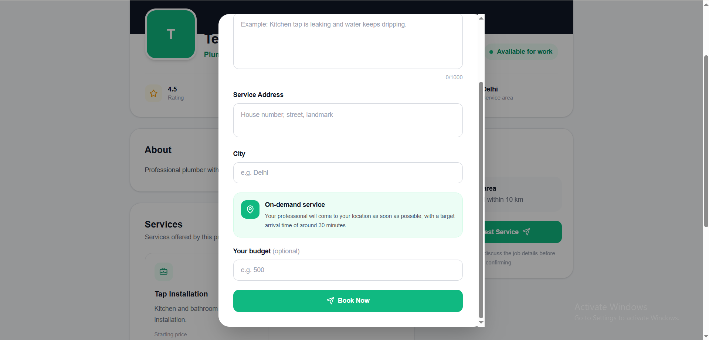

# 🚀 Karigro – On-Demand Skilled Worker Booking Platform

Karigro is a full-stack web application that connects customers with nearby skilled professionals such as plumbers, electricians, carpenters, mechanics, and AC repair technicians. Inspired by platforms like **Rapido** and **Zepto**, Karigro focuses on **instant service booking**, where workers are expected to reach the customer's location within **30 minutes**.

## 🌐 Live Demo

- **Live Website:** `https://karigro.vercel.app/`
- **GitHub Repository:** `https://github.com/theabhiworks/karigro`

---

## ✨ Features

### Customer Features

- 🔐 Secure Registration & Login
- 👤 Editable Customer Profile
- 🔍 Search nearby professionals
- 📍 Location-based instant booking
- ⚡ 30-minute on-demand service requests
- 📋 Track request status
- ❌ Cancel pending requests
- ⭐ Rate and review completed services
- 🔔 Real-time notifications

### Worker Features

- 🔐 Secure Registration & Login
- 👨‍🔧 Professional Profile Management
- 🛠 Manage offered services
- 📥 Receive booking requests instantly
- ✅ Accept or Decline requests
- ✔ Mark jobs as completed
- ⭐ Automatic rating updates
- 📊 Dashboard with real-time statistics

### Smart Workflow

Customer → Book Worker → Worker Accepts → Worker Arrives → Job Completed → Customer Reviews

---

## 📸 Screenshots

| Landing Page | Worker Dashboard |
|--------------|------------------|
|  |  |

| Customer Dashboard | Booking |
|--------------------|---------|
|  |  |

---

## 🏗 Tech Stack

| Category | Technology |
|----------|------------|
| Frontend | Next.js 15 |
| Language | TypeScript |
| Styling | Tailwind CSS |
| Database | Neon PostgreSQL |
| ORM | Prisma |
| Authentication | JWT + Cookies |
| Icons | Lucide React |
| Deployment | Vercel |

---

## 📂 Project Structure

```text
app/
├── api/
│   ├── auth/
│   ├── notifications/
│   ├── profile/
│   ├── requests/
│   ├── reviews/
│   ├── worker/
│   └── workers/
├── dashboard/
│   ├── customer/
│   └── worker/
├── components/
└── page.tsx

prisma/
├── schema.prisma
└── migrations/
